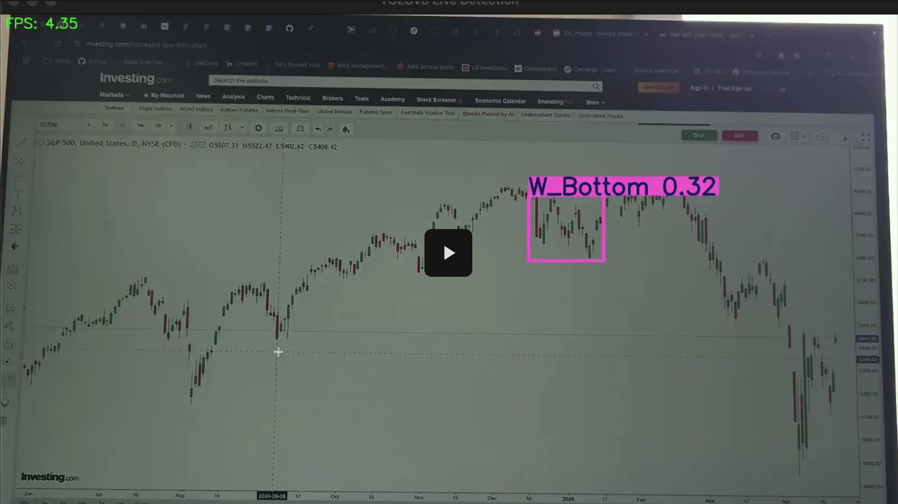
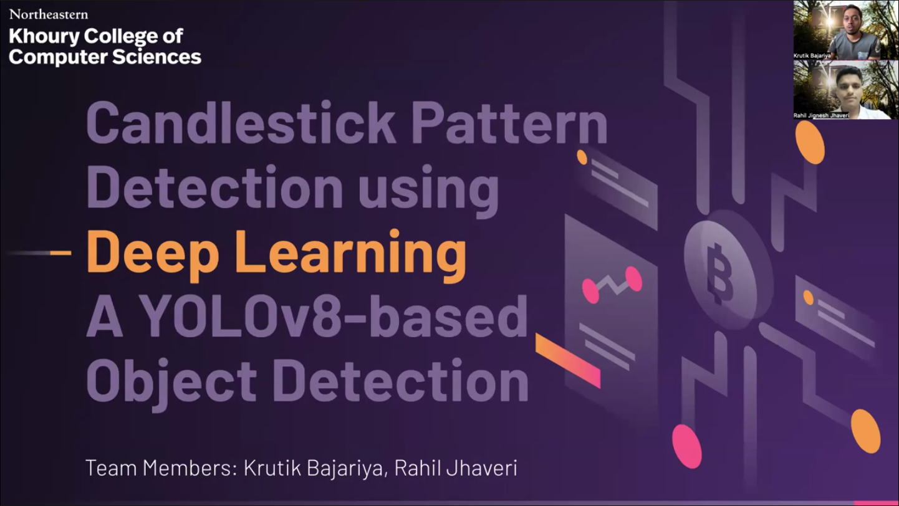

# Project Title: Implementation of a Fine-tuned YOLO Model for Stock Candlestick Pattern Identification

# Group Members: 
Rahil Jhaveri and Krutik Bajariya

# Problem Statement:
Stock price movements exhibit various patterns that traders and analysts use to make informed decisions. However, identifying these patterns manually is time-consuming and prone to human error. This project aims to implement a fine-tuned YOLO (You Only Look Once) model to detect and classify common stock price patterns, such as head and shoulders, double tops and bottoms, and cup and handle formations. The input to the model will be historical stock price charts, and the output will be detected patterns overlaid on the charts.

# Demo Video

# Presentation Video Link

# Dataset Link
The dataset used in this project is available at the following location:

**[📎 Download Dataset](https://drive.google.com/drive/folders/1KKTvYTwWtxgQmVlzujrY67OdkGqzQiSv?usp=drive_link)**  

### 📁 Contents
The dataset contains the following:
- `raw_data`: Main data file with all raw images and labels
- `train`: Training data used for model development
- `test`: Testing data used for model development
- `val`: Validation data used for tuning model performance
- `dataset.yaml`: Configuration file describing the dataset structure and metadata